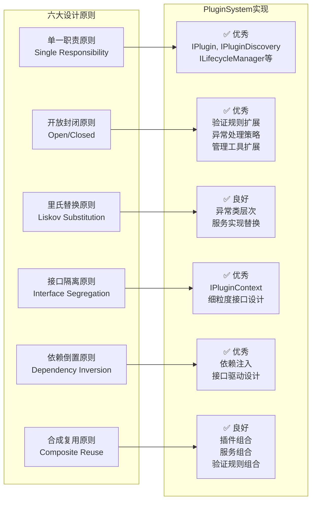
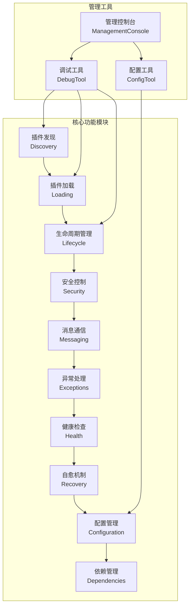
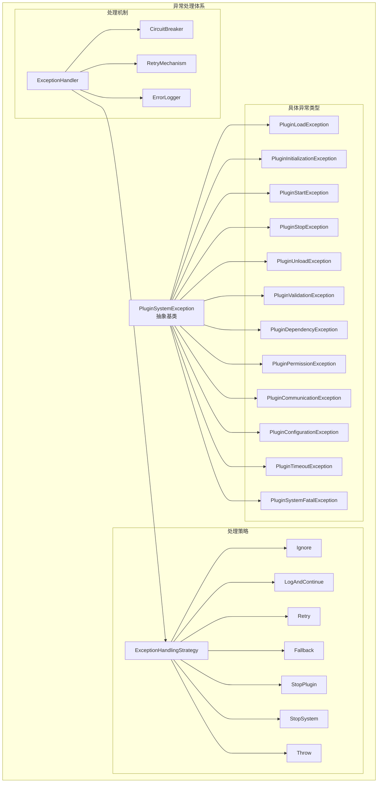
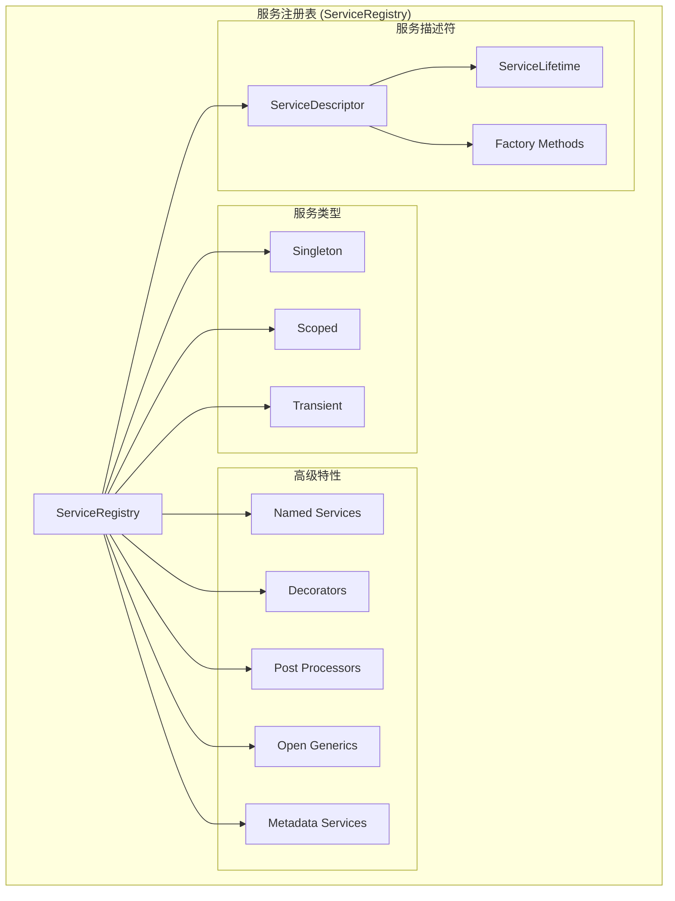
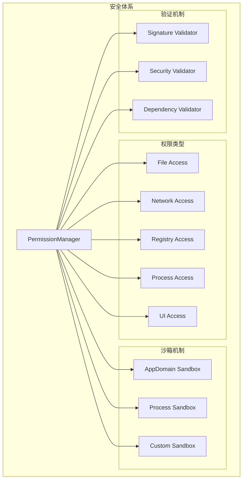

# PluginSystem 架构图

## 整体架构图

```mermaid
graph TB
    subgraph "应用层 (Application Layer)"
        App[应用程序]
        UI[用户界面]
    end
    
    subgraph "插件系统核心 (PluginSystem Core)"
        subgraph "宿主层 (Host Layer)"
            Host[PluginHost]
            HostBuilder[HostBuilder]
        end
        
        subgraph "核心抽象层 (Core Abstractions)"
            IPlugin[IPlugin]
            IPluginHost[IPluginHost]
            IPluginContext[IPluginContext]
            IServiceRegistry[IServiceRegistry]
        end
        
        subgraph "服务层 (Services Layer)"
            ServiceRegistry[ServiceRegistry]
            MessageBus[MessageBus]
            ConfigStore[ConfigurationStore]
        end
        
        subgraph "管理层 (Management Layer)"
            LifecycleManager[LifecycleManager]
            PermissionManager[PermissionManager]
            Validator[PluginValidator]
            ExceptionHandler[ExceptionHandler]
            HealthCheck[HealthCheckService]
            SelfHealing[SelfHealingService]
        end
        
        subgraph "基础设施层 (Infrastructure Layer)"
            Discovery[PluginDiscovery]
            Loader[PluginLoader]
            Security[Security/Sandbox]
            Messaging[Messaging]
            Validation[Validation]
            Exceptions[Exceptions]
            Health[Health]
            Recovery[Recovery]
        end
    end
    
    subgraph "插件层 (Plugin Layer)"
        Plugin1[插件1]
        Plugin2[插件2]
        PluginN[插件N]
    end
    
    App --> Host
    UI --> Host
    Host --> IPluginHost
    HostBuilder --> Host
    
    Host --> ServiceRegistry
    Host --> MessageBus
    Host --> LifecycleManager
    Host --> PermissionManager
    Host --> Validator
    Host --> ExceptionHandler
    Host --> HealthCheck
    Host --> SelfHealing
    
    ServiceRegistry --> IServiceRegistry
    MessageBus --> IMessageBus
    LifecycleManager --> ILifecycleManager
    PermissionManager --> IPermissionManager
    Validator --> IPluginValidator
    ExceptionHandler --> IExceptionHandler
    HealthCheck --> IHealthCheckService
    SelfHealing --> ISelfHealingService
    
    Discovery --> IPluginDiscovery
    Loader --> IPluginLoader
    Security --> ISandbox
    Messaging --> IMessageBus
    Validation --> IValidationRule
    Exceptions --> PluginSystemException
    Health --> IHealthCheck
    Recovery --> IRecoveryStrategy
    
    Host --> Plugin1
    Host --> Plugin2
    Host --> PluginN
    
    Plugin1 --> IPlugin
    Plugin2 --> IPlugin
    PluginN --> IPlugin
```

## 设计原则符合性图

## 功能模块关系图

## 异常处理架构图

## 服务注册表架构图

## 安全架构图

## 总结

PluginSystem的架构设计体现了以下特点：

1. **分层清晰**：从应用层到基础设施层，层次分明
2. **模块化**：各功能模块独立，职责明确
3. **可扩展**：支持插件扩展和服务扩展
4. **安全可靠**：完善的安全机制和异常处理
5. **高性能**：优化的加载和运行机制
6. **易维护**：清晰的接口设计和依赖管理

这是一个设计优秀、功能完善的企业级插件框架。
